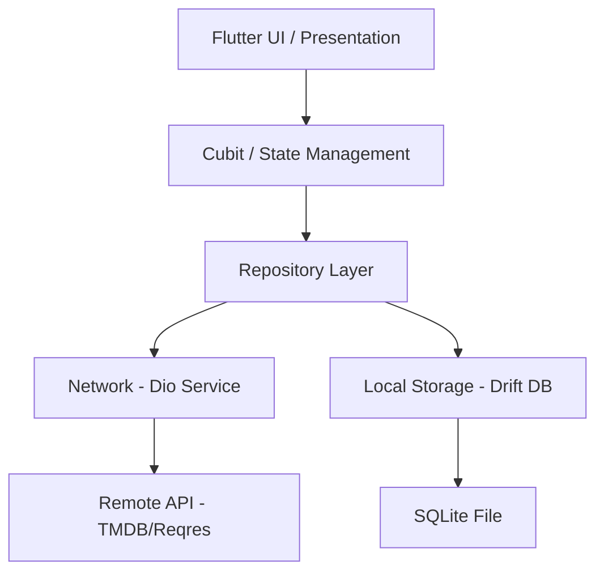
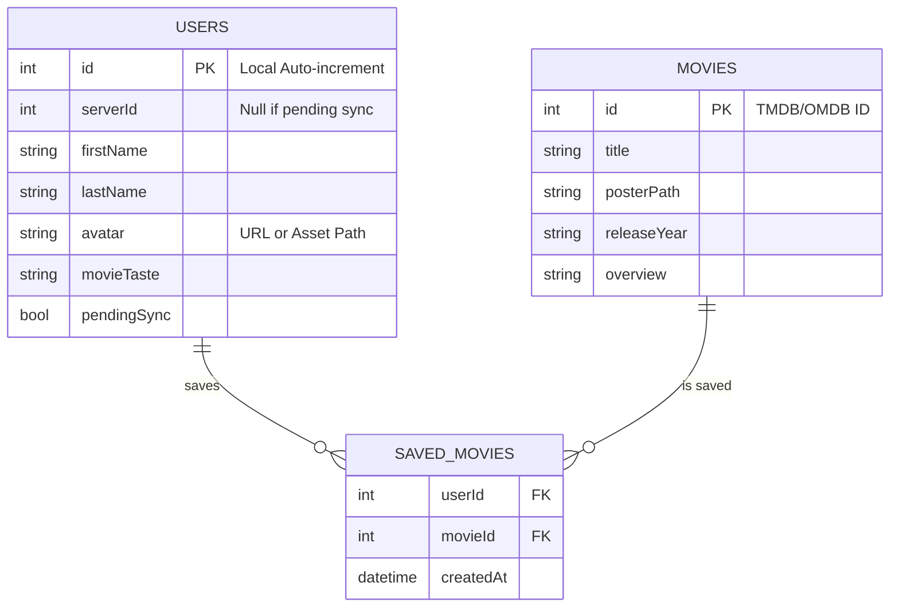

# Match & Watch 🎬

A premium Flutter application designed for movie discovery and social matching, built with a focus on **offline-first reliability**, **high-performance animations**, and **clean architecture**.

## 🏗 System Architecture

The project follows a modified Clean Architecture pattern with BLoC/Cubit for state management, ensuring a clear separation of concerns between UI, Business Logic, and Data.



## 📊 Database Schema

Our database uses a dual-ID system (Local ID vs. Server ID) to ensure that relationships between users and saved movies are never broken during background synchronization.



## 🎨 Design System

We employ a **12dp/16dp mathematical grid system** for consistent spatial alignment.

| Token | Value | Choice |
| :--- | :--- | :--- |
| **Primary Gold** | `#FFD700` | High contrast against dark theme, creates a premium feel. |
| **Card Radius** | `16dp` | Soft, modern corners for a friendly UI. |
| **Grid Base** | `4dp / 8dp` | Ensures all components are vertically and horizontally aligned. |
| **Animations** | `300ms - 500ms` | Curved transitions (EaseInOut) for natural motion. |

## 📶 Offline & Sync Strategy

The app is built to be fully functional in "Airplane Mode":

1.  **Aggressive Caching**: Every network response from TMDB or Reqres is immediately upserted into the Drift SQLite database. The UI always watches a Stream from the database, never the network directly.
2.  **Pending Sync Mechanism**: When a user is created offline, we flag them with `pendingSync: true`.
3.  **WorkManager**: A background periodic task (every 15 mins) identifies pending users, attempts to POST them to the server, and updates the local record with the newly assigned `serverId` once successful.
4.  **Resilient Networking**: A custom Dio Interceptor handles retries with **Exponential Backoff** (1s, 2s, 4s...) and provides non-blocking UI feedback via a global "Reconnecting..." state.

## 🤝 AI Collaboration
This project was developed in a partnership between a lead architect and a senior AI engineer. The full context, decision logs, and refactoring history can be found in `PROMPTS.md`.

## 🧪 Testing Strategy

The project includes a strategic test suite to ensure stability and correctness:

*   **Unit Tests**: Verifying Repository logic, ensuring offline caching and database interactions work as expected using `mocktail`.
*   **Bloc Tests**: Using `bloc_test` to verify state transitions in response to events (e.g., `Loading -> Loaded`).
*   **Widget Tests**: Ensuring critical UI components like `MovieCard` render correctly and handle user interactions.

To run the tests:
```bash
flutter test
```

## 📦 Production Release

The production-ready APK is available for download here:
[Download Match&Watch Release APK](https://drive.google.com/file/d/1OPQaY23cMHD82n4dt5lE2T9CAMqBcxVI/view?usp=drive_link)

---
*Built with ❤️ for Platform Commons.*
